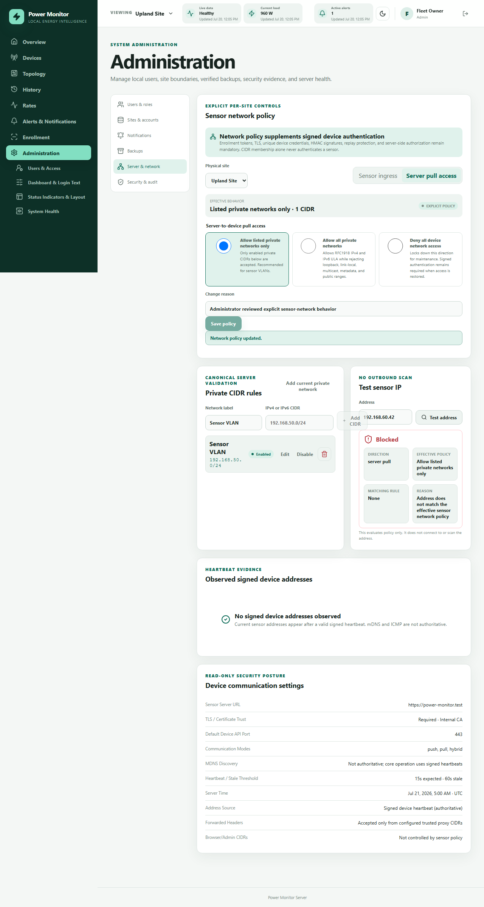

# Sensor network policy

Open **Administration > Sites & Network > Network Policy** to manage the policy for each physical site. Browser
and administrator access is intentionally outside this control.

Two independent directions are modeled:

- **Sensor ingress** covers enrollment, signed heartbeats, pushed readings, status, and device
  events.
- **Server pull access** covers worker health checks, history pull, configuration, diagnostics,
  and firmware operations.

Each direction supports **Allow listed private networks only**, **Allow all private networks**,
and **Deny all**. Listed mode needs an enabled CIDR. All-private means RFC1918 IPv4 and IPv6 ULA;
it still rejects loopback, link-local, multicast, broadcast, unspecified, cloud-metadata, public,
and reserved ranges. CIDRs are canonicalized, duplicates are rejected, and overlaps are returned
as warnings.

## Legacy migration meaning

The former UI's `0 permitted CIDRs` was ambiguous, but the implementation was not:

- an empty list with public polling off rejected every server-pull target, so migration
  `20260721_0008` creates explicit **Deny all** for server pull;
- a non-empty list permitted only its normalized destinations (plus the separately enabled public
  behavior when both site and deployment opted in), so those entries are copied into explicit
  rules;
- signed device ingress previously had no CIDR restriction. Migration uses the visible
  **Legacy signed ingress · review required** state to preserve that behavior exactly until an
  administrator selects one of the reviewed modes.

Every migrated policy has an immutable revision and audit event, and displays a one-time review
notice. Saving an explicit mode clears the notice. No migration silently converts allow to deny
or deny to allow.

## Safe administration

**Add current private network** suggests only a narrow `/24` IPv4 or `/64` IPv6 ULA/private
network from the direct trusted client context, shows it for review, and never saves it
automatically. If the server sees a loopback, public, or untrusted proxy address it makes no guess.

**Test sensor IP** parses and evaluates an address locally. It reports direction, effective mode,
matching rule, and reason, and performs no scan or outbound connection. IPv4-mapped IPv6 is
canonicalized before evaluation.

Signed heartbeats remain the authoritative current-address source. When a reported address
changes, server-pull policy is reevaluated and an outside-policy result is recorded on the address
and in audit evidence. Worker resolution and connection validation still protect against DNS
rebinding.

Network policy is defense in depth. TLS verification, short-lived enrollment tokens, UUID device
identity, unique credentials, HMAC body/timestamp/nonce validation, and replay prevention remain
mandatory. CIDR membership alone can never authenticate a request.
