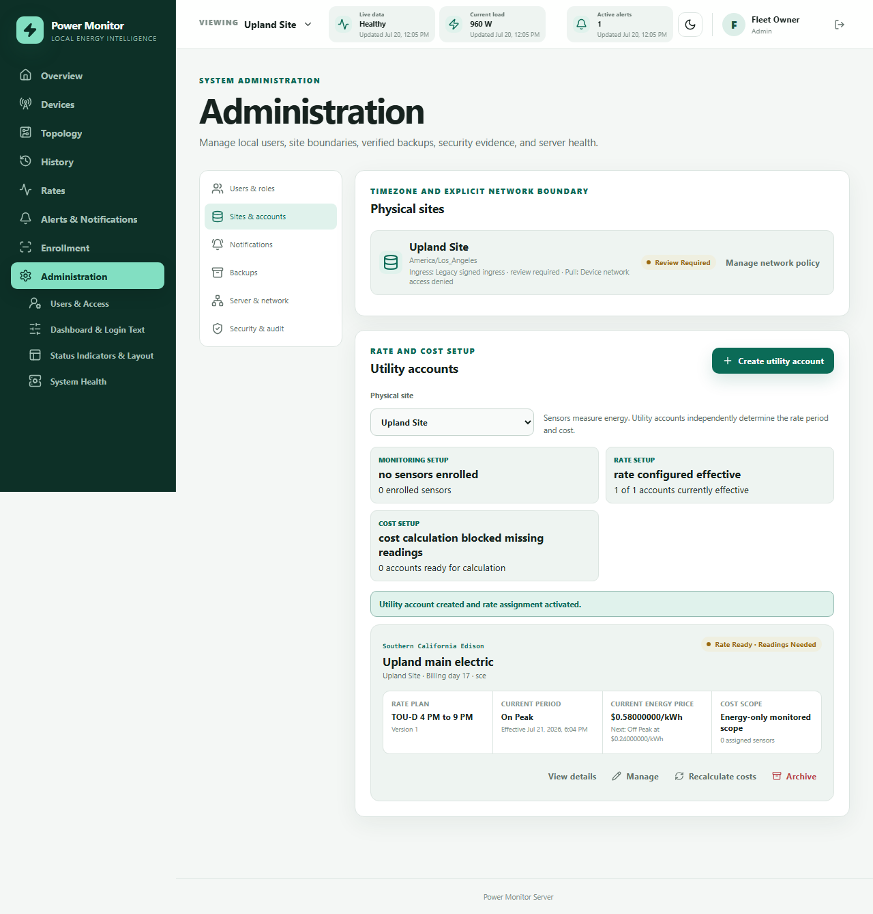

# Utility accounts

Utility accounts and sensors solve different prerequisites. A sensor provides live power and
historical energy. A utility account supplies the effective rate context used to identify the
current time-of-use period and estimate cost. Enrolling a sensor never guesses the customer's
tariff.

## Create an account

Open **Billing > Utility Accounts**, select the physical site, and choose **Create utility
account**. The seven reviewable steps collect:

1. a display name, optional nickname, and optional masked suffix (the full account number is not
   stored);
2. SCE bundled, CCA, Direct Access, or custom/manual provider context;
3. inherited site timezone, billing-cycle day, currency, baseline, and service class;
4. one approved/published rate version and its effective window;
5. an explicit cost scope;
6. separately sourced adjustments, without copying components already in the rate version; and
7. a complete confirmation summary.

Multiple accounts can belong to one site. Assign each device/circuit/aggregate to the applicable
account in topology; site membership alone does not decide which meter a sensor represents.

The physical-site card reports both effective network directions and links to **Administration > Sites & Network > Network Policy**.
It is a location/timezone boundary, not a utility account. The rate library is likewise not an
assignment: **Published · Available** means that a reviewed version may be selected, not that the
customer is billed on that tariff.

## Rate assignments

Assignments are effective-dated records. A change creates a new assignment, closes an earlier
open window at the new boundary when safe, rejects all other overlap, and preserves assignment
history. Approved future versions can be scheduled. Rate versions and finalized billing cycles
are never rewritten. Recalculation requests queue only unfinalized runs.

The account card's **Manage** area edits account identity/billing day, schedules a published
version, changes cost scope with optimistic concurrency, adds separately sourced adjustments, and
shows immutable assignment and adjustment histories. **Archive** deactivates the account while
retaining rate-version IDs, costs, readings, reports, and audit evidence. There is no destructive
account-delete operation.

The Rates page uses these distinct library states: **Draft**, **Published · Available**,
**Assigned**, and **Effective now · account**. **Use this plan** opens an explicit account
selector. **Switch now** ends the selected account's prior assignment at the server-recorded
switch instant, makes the new version effective, and preserves the prior window and audit
evidence. **Schedule a change** keeps the current plan effective until the selected future
instant. An already scheduled later change is retained rather than silently overwritten.

Only one plan can be effective for a utility account at an instant. Different accounts may use
different plans concurrently, so the selector always names the account being changed. The same
operation remains available under the account card's **Manage** area; typed overlap failures are
shown inline instead of being discarded.

## Cost scopes

- **Energy-only monitored scope** is the recommended default for one-CT, branch-circuit, and
  partial-site monitoring. It includes interval energy charges and excludes full-account fixed
  charges and credits.
- **Allocated account estimate** requires a documented allocation method.
- **Complete utility-account estimate** requires complete topology evidence or an explicit
  administrator override recorded in audit history. It may include eligible fixed charges,
  credits, taxes, and provider adjustments once per account.

CCA and Direct Access generation can differ from SCE bundled generation. Record any separate
adjustment with its provenance and effective dates.

Provider modes are explicit: SCE bundled, SCE delivery with CCA generation, SCE delivery with
Direct Access generation, or a reviewed custom/manual provider. Never copy a generation/fixed
component already present in the selected rate version into account adjustments. Effective-dated
per-kWh adjustments are prorated to only their covered reading intervals. Fixed account charges
and baseline credits remain excluded unless the account and aggregate are explicitly complete,
so they apply once rather than once per sensor.

## Billing cycles

The start day is 1–31 in the account's inherited site timezone. A shorter month uses its last
valid day; persisted boundaries are UTC instants. Changing the day affects only unfinalized
estimates. Finalized cycles and reports keep their original boundaries and rate-version evidence.

Tiered and hybrid plans additionally require an explicit account-usage
authority. A full-account aggregate or reviewed complete sensor set may advance
tier usage. Partial circuits remain valid for energy-only history but need
manual/imported whole-account context for tier pricing. Utility cycle-date and
usage imports use preview, normalization, content hashing, conflict review,
commit, and audited reversal. See [Account usage
authority](ACCOUNT_USAGE_AUTHORITY.md), [Billing cycles](BILLING_CYCLES.md), and
[Usage imports](USAGE_IMPORTS.md).

## Readiness

Monitoring readiness and rate/cost readiness are deliberately separate. An effective account
assignment can show current plan, period, and price before a sensor reports. Live power still
requires a valid signed heartbeat; history requires readings; cost requires readings plus a
historically effective assignment. Missing configuration is shown as unavailable, never a false
`$0.00`.

Accounts with assignments, costs, readings, reports, or audit history are archived rather than
deleted. Archive keeps all historical calculations and rate-version references intact.

See the deterministic administrative examples in
`backend/tests/test_utility_account_network_policy.py` and the browser workflow in
`frontend/e2e/shell.spec.ts`. Neither depends on a live SCE website.
