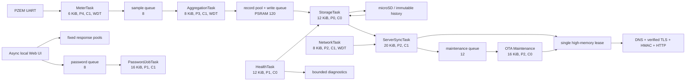

# Firmware task and resource map

## Scope and source of truth

This map describes the ESP32-S3 production runtime in the sibling
`power-monitor-sensor` repository after the internal-DRAM/TLS admission repair.
The task constants are defined in `include/app/TaskConfig.h`; creation and core
affinity are defined in `src/app/Application.cpp`, `src/api/HttpApi.cpp`, and
`src/diagnostics/SerialLogger.cpp`. ESP-IDF's Arduino port expresses task stack
depth and high-water marks in **bytes**, not `StackType_t` words.

The shared protocol remains exactly `pm-protocol/1.0.0`. The repair does not
change the device/server contract, certificate validation, HMAC verification,
the 64 KiB total-internal TLS floor, or the 32 KiB contiguous TLS floor.

## Tasks

| Task | Stack | Priority | Core | Watchdog | Normal cadence / wait | Principal blocking work and ownership |
|---|---:|---:|---:|---|---|---|
| `DiagLogTask` | 4 KiB | 1 | 0 | no | waits on 32-entry queue | Sole formatted serial-output owner; bounded mutex waits |
| `MeterTask` | 6 KiB | 4 | 1 | yes | configured sample interval; default 1 s | PZEM UART poll and validation while holding `meter_mutex_`; 5 s bounded acquisition |
| `AggregationTask` | 8 KiB | 3 | 1 | yes | waits up to 1 s on samples | Interval aggregation, energy normalization, enqueue durable records |
| `StorageTask` | 12 KiB | 0 | 0 | no | drains work/control queues | Sole runtime FAT/microSD mutation owner; bounded scans yield every small chunk |
| `NetworkTask` | 8 KiB | 2 | 1 | yes | 250 ms | Wi-Fi state machine, DHCP, DNS/mDNS/NTP setup and reconnect progression |
| `ServerSyncTask` | **20 KiB** | 2 | 1 | no | 250 ms between ticks | Sole central DNS/TLS/HTTP/HMAC owner; heartbeat, reading/event batch, config, manifest |
| `HealthTask` | 12 KiB | 1 | 0 | no | 1 s; detailed sample every 60 s | Pressure classification, task metrics, retention scheduling, durable diagnostic events |
| `OtaMaintenanceTask` | 16 KiB | 2 | 0 | no | waits up to 1 s on 12-entry queue | Signed OTA and explicit maintenance/rebuild work |
| `SerialCommandTask` | 24 KiB | 1 | 0 | no | 25 ms | Physical serial commands and verified atomic configuration changes |
| `PasswordJobTask` | 16 KiB | 1 | 1 | no | waits up to 1 s on 8-entry queue | PBKDF2/password work outside AsyncWebServer callbacks |

The ten production allocations total 126 KiB. `ServerSyncTask` previously
reserved 24 KiB. A physical 1.0.15 trace measured 14,612 bytes unused at its
deepest observed checkpoint. The new 20 KiB allocation therefore projects
10,516 bytes unused (51%) for that same path, preserving more than the required
25% while returning 4 KiB of internal DRAM. This is physically grounded sizing,
not permission to shrink other task stacks.

The runtime diagnostics table now reports `ServerSyncTask` on core 1, matching
its actual `xTaskCreatePinnedToCore` call. It formerly mislabeled the task as
core 0.

## Queues and bounded pools

| Resource | Capacity | Producer(s) | Consumer / owner | Full behavior |
|---|---:|---|---|---|
| Measurement sample queue | 8 snapshots | `MeterTask` | `AggregationTask` | Nonblocking send; increments and logs a sample drop |
| Storage write queue | 120 messages | Aggregation/health | `StorageTask` | Bounded failure and drop telemetry; never grows |
| Storage control queue | 8 messages | Sync/health/UI actions | `StorageTask` | Bounded failure/coalescing depending on operation |
| Durable record pool | 120 fixed slots in PSRAM | Aggregation | `StorageTask` | Exhaustion is counted; no internal-heap fallback |
| Durable event pool | 16 fixed slots in PSRAM | Diagnostics/health | `StorageTask` | Exhaustion is counted; no internal-heap fallback |
| Maintenance queue | 12 messages | Sync and local API | `OtaMaintenanceTask` | Nonblocking enqueue with typed failure |
| Password queue | 8 pointers to bounded jobs | Local API | `PasswordJobTask` | Typed busy response; callbacks do not run PBKDF2 |
| Password results | 16 fixed entries | Password worker | Local API polling | Protected by bounded result mutex |
| Serial log queue | 32 fixed messages | All tasks | `DiagLogTask` | Drop counter and rate-limited evidence |
| Compact status bodies | 2 x 2,048 bytes | Local Web UI | Async response lifecycle | Pool exhaustion returns bounded 503 |
| Local-health body | 1 x 3,072 bytes | LAN health probe | Async response lifecycle | Concurrent request returns bounded 503 |
| TLS lifecycle ring | 32 fixed checkpoints | Sync/OTA | Diagnostics readers | Oldest evidence is overwritten intentionally |
| Wi-Fi transition ring | 16 fixed entries | Wi-Fi callback/state machine | `HealthTask` persistence | Oldest evidence is overwritten intentionally |

The current sample/storage full behavior is visible and bounded, but a full
queue can still discard a newly produced interval. That is a durability risk,
not an unbounded-memory risk, and remains an explicit follow-up acceptance item
for the broader audit.

## Locks, ownership, and ordering

- `meter_mutex_` serializes PZEM access between sampling and explicit local
  tests. It is acquired in bounded watchdog-fed slices.
- `ConfigService` owns recursive `mutation_mutex_` and `state_mutex_`.
  Mutation paths take mutation first and reserve/copy state second; long DNS,
  TLS, HTTP, SD, and PZEM operations must occur after release.
- `NetworkService::status_mutex_` protects compact network state. Network state
  changes belong to `NetworkTask`; callbacks must only capture bounded facts.
- `SdStorage::mutex_` protects card/FAT ownership; its separate health-snapshot
  mutex exposes a last-complete status without reading partially rebuilt data.
- `StorageCoordinator::history_mutex_` protects bounded job/results, not the FAT
  operation itself.
- `Diagnostics::high_memory_mutex_` is the single high-memory lease. Storage
  recovery, TLS, and OTA do not overlap high-memory phases.
- `ServerSyncTask` plus `SingleFlightGate` is the only central TLS owner. Local
  UI callbacks never perform server TLS work.
- Authentication, password results, serial history/rate/output, and diagnostic
  snapshots use separate bounded mutexes. No documented path holds one while
  performing central TLS or a full SD scan.

## Task/resource flow



## TLS admission and health semantics

Every central request still requires:

```text
free internal DRAM >= 65,536 bytes
largest contiguous internal block >= 32,768 bytes
heap integrity = valid
```

`GET /api/local/health` now computes `tls_ready` directly from the same current
heap snapshot and the same `memoryTlsReady` policy used by transport admission.
It no longer returns the pressure controller's intentionally hysteretic cached
Boolean, which could describe an earlier sample and contradict the next sync
preflight.

## Verification boundaries

Repository/native tests enforce the 20 KiB allocation, the projected margin,
the unchanged TLS guards, the live-snapshot `tls_ready` decision, and matching
ServerSync core telemetry. Builds prove compile/link capacity. Only a physical
canary using the exact new ELF can prove allocator coalescence, maximum TLS
call depth, radio behavior, SD/PZEM timing, and long-run heartbeat recovery.
